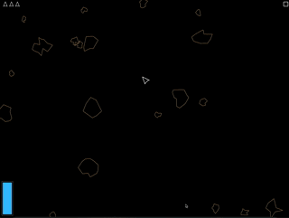

# Zigsteroids

Basicly following jdh - [making a game in zig](https://www.youtube.com/watch?v=ajbYYgbDXGk)

Refactoring the code along the way, adding features, and practicing zig.



## Playing

You have 3 lives, at 0 lives the game reset.

- `W` - Go forward
- `A`, `D` - Rotate Ship
- `Left-Control + R` - Reset game
- `Left-Shift` - Use MEGA FUEL for burst, make you invulnerable while in burst -- use with caution.
- `Left-Control + D` - Toggle Visual Debug
- `Escape` - Pause Game

## Build

To build and run:

```sh
zig build run
```

## TODO

Missing features:

- Alien Ship
