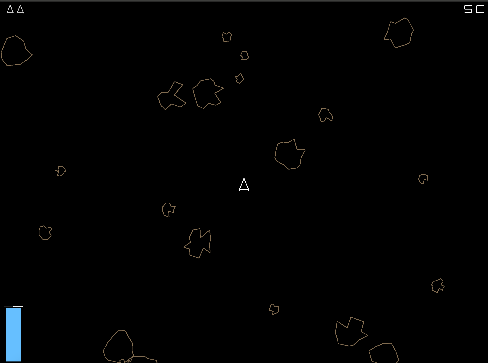

# Zigsteroids

Basicly following jdh - [making a game in zig](https://www.youtube.com/watch?v=ajbYYgbDXGk)

Refactoring the code along the way, adding features, and practicing zig.



## Playing

you have 3 lives, at 0 lives the game reset.

W - Go forward
A, D - Rotate Ship
Left-Shift - use MEGA FUEL for burst.
Left-Control - reset game

## Build

To build and run:

```sh
zig build run
```

To build and run with vizual debugging:

```sh
zig build run -- --debug-viz
```
